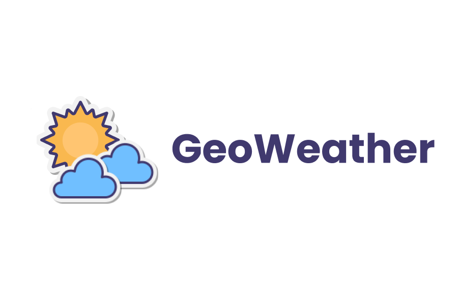

# GeoWeather



A weather app for [Midudev](https://www.twitch.tv/midudev)'s Hackathon built with React.

## Go to:
  - [Features](https://github.com/ikurotime/GeoWeather/edit/master/README.md#features-)
  - [Installation](https://github.com/ikurotime/GeoWeather/edit/master/README.md#features-)

## Features ✨

- Autocomplete search
- Map
- Current day weather data
- Current day data by hour
- Forecast day weather
- Forecast day data by hour
- Celsius / Farenheit
- Temperature Chart
- Dark Mode

## Installation 🔧

Install GeoWeather

- Go to the project folder
- Run the following commands

```bash
  npm install
  npm run dev
```

- Go to `index.html`
- Replace the API Key from Google Maps API with your key, available [here](https://mapsplatform.google.com/intl/es-419_ALL/)

```
<script async
   src="https://maps.googleapis.com/maps/api/js?key={YOURAPIKEY}&language=en&components=locality&libraries=places&callback=myCallbackFunc">
</script>
```
